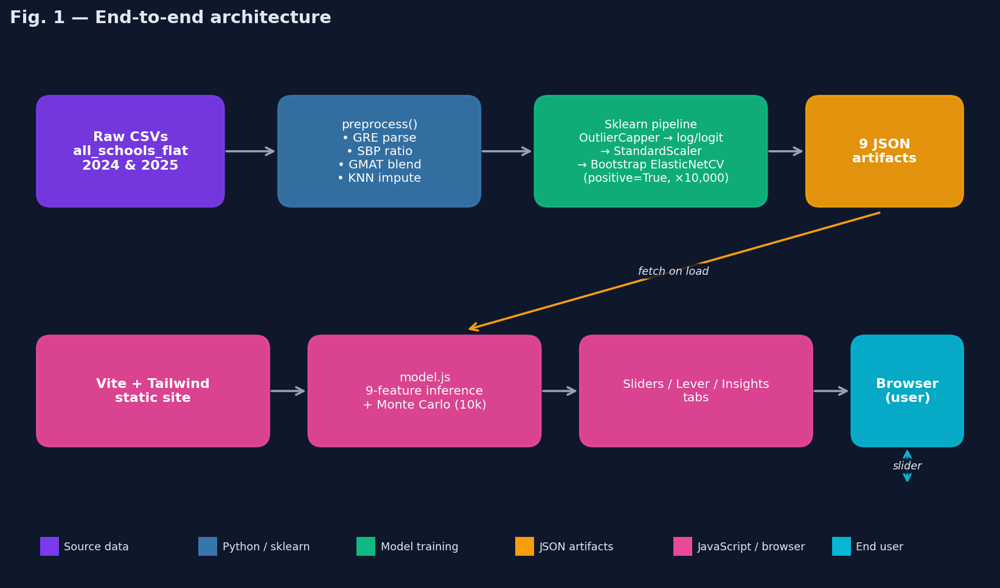
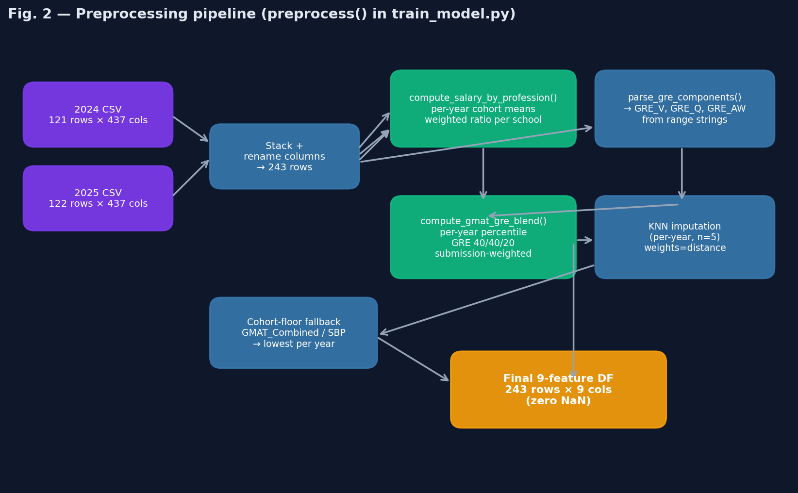
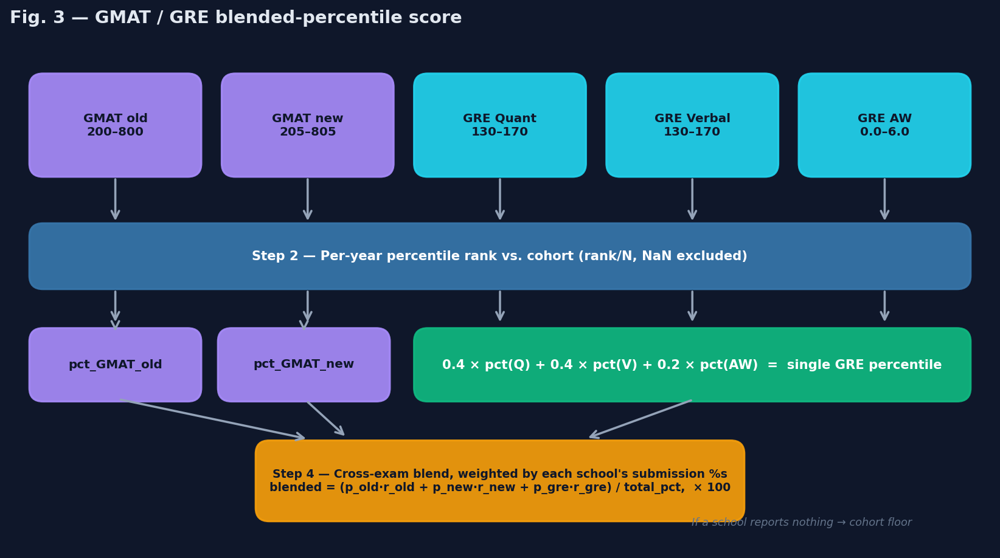
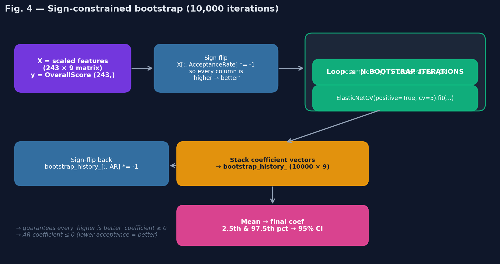
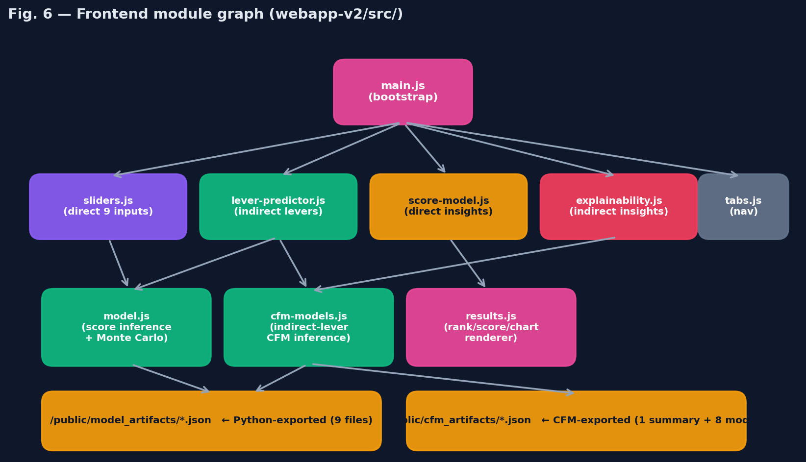
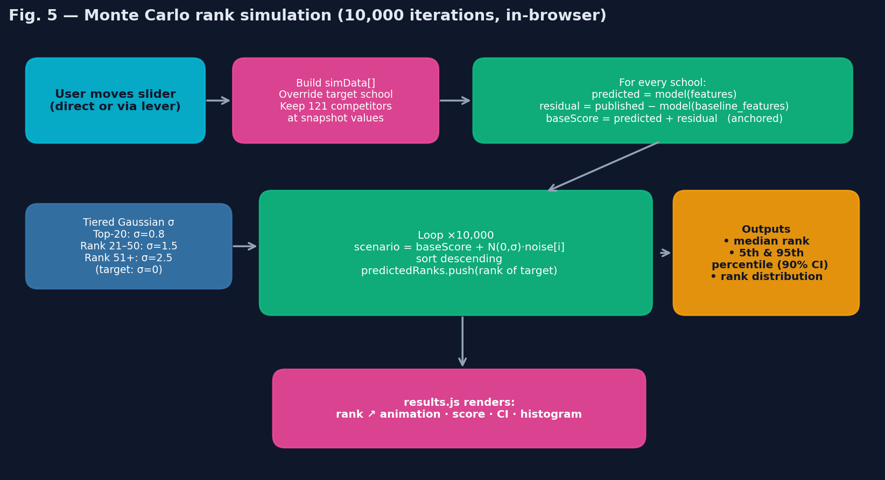

# 1. System overview

The GWSB Ranking Predictor is a static-served single-page web app backed by a one-shot Python training pipeline. The Python side runs *once* per data refresh and writes nine JSON artifact files; the JavaScript side fetches those artifacts on page load and runs all inference (including a 10,000-iteration Monte Carlo simulation) entirely in the browser. There is no backend server, no database, no API, and no per-user state.



This separation means:

- **Predictions are deterministic from the artifacts.** Any deployed instance with the same artifacts produces the same numeric outputs.
- **Training is reproducible.** Given the same two CSVs and the same Python environment, `python train_model.py` produces bit-identical artifacts modulo bootstrap RNG.
- **Hosting is trivial.** The whole app is a static directory (`dist/`) deployable to any CDN, S3 bucket, or Vercel project. No env vars, no secrets.

### Repository layout

```
webapp-v2/
├── index.html                       # 4-tab layout
├── package.json                     # vite, tailwindcss, chart.js, postcss
├── vite.config.js                   # dev port 3100
├── tailwind.config.js               # custom indigo/cyan palette
├── postcss.config.js
├── vercel.json                      # framework=vite
├── styles/
│   └── index.css                    # tailwind + custom components
├── src/
│   ├── main.js                      # bootstrap; await loadModel + loadCfmArtifacts
│   ├── tabs.js                      # tab nav + tab:activated CustomEvent
│   ├── model.js                     # 9-feature inference + Monte Carlo
│   ├── sliders.js                   # Tab 1 direct sliders + SBP + GMAT/GRE composite
│   ├── lever-predictor.js           # Tab 2 indirect levers (CFM-driven)
│   ├── score-model.js               # Tab 3 explainability
│   ├── explainability.js            # Tab 4 — 8 CFM cards with inline % contribution lists
│   ├── cfm-models.js                # CFM artifact loader + JS inference
│   └── results.js                   # rank/score/CI/Chart.js renderer
├── public/
│   ├── model_artifacts/             # 9 JSON files — output of train_model.py
│   └── cfm_artifacts/                # 9 JSON files — output of core_feature_models/
├── scripts/
│   ├── train_model.py               # data → artifacts (single command)
│   └── requirements.txt
└── docs/
    ├── user-guide.md                # business-facing
    ├── technical-docs.md            # this document
    └── img/                          # fig01..fig06 referenced here
```

---

# 2. Data layer

## 2.1 Sources

Two CSVs supplied by US News, both with identical schemas (~437 columns):

| File | Path relative to `scripts/` | Rows | Use |
|---|---|---:|---|
| 2024 panel | `../../all_schools_flat_2024.csv` | 121 | Historical year |
| 2025 panel | `../../all_schools_flat_2025.csv` | 122 | Current year |

Each row is one school for one ranking year. After stacking with a synthetic `Year` column, we have **243 school-year observations**. The same school appears once per year it was ranked. The Python pipeline never modifies these files.

## 2.2 Columns we consume

`train_model.py` renames a small subset of the 437 columns to short identifiers via `COLUMN_RENAME_MAP`:

| Role | Raw column → Renamed |
|---|---|
| Identity | `school_info.school_name` → `School`, `school_info.us_news_rank` → `Rank` |
| Target | `school_info.us_news_overall_score` → `OverallScore` |
| Indicator inputs | `ranking_scores_two_year_averages.fulltime_employed_at_graduation_two_yr_avg` → `EmployedAtGrad`, `..._3_months_after_two_yr_avg` → `Employed3Mo`, `..._avg_starting_salary_and_bonus_two_yr_avg` → `AvgSalaryBonus`, `..._median_undergraduate_gpa` → `MedianGPA`, `..._acceptance_rate` → `AcceptanceRate`, `..._peer_assessment_score_out_of_5` → `PeerScore`, `..._recruiter_assessment_score_out_of_5` → `RecruiterScore` |
| Test medians | `..._median_gmat_score_fulltime_old` → `GMAT_Old`, `..._median_gmat_score_fulltime_new` → `GMAT_New` |
| Test submission % | `gmat_data.percent_new_entrants_providing_gmat_old` → `Pct_GMAT_Old`, `_new` → `Pct_GMAT_New`, `gre_data.percent_new_entrants_providing_gre` → `Pct_GRE` |
| GRE range string | `gre_data.gre_score_range_10th_90th` → `GRE_Range_Str` |
| Salary by profession | 8 indexed slots `base_salary_by_occupation[i].{occupation,average_salary,number_reporting_jobs}` (kept under original names) |

Everything else is ignored.

## 2.3 The 9 final indicators

The score model and all artifacts work in terms of these 9 names:

| Indicator | Type | Domain | Source |
|---|---|---|---|
| `EmployedAtGrad` | proportion | [0, 1] | Direct column |
| `Employed3Mo` | proportion | [0, 1] | Direct column |
| `AvgSalaryBonus` | dollars | ~$60k – $220k | Direct column |
| `SalaryByProfession` | cohort ratio | ~[0.4, 1.4] | **Computed** — see §3.3 |
| `MedianGPA` | GPA | [3.0, 4.0] | Direct column |
| `AcceptanceRate` | proportion | [0, 1] | Direct column; **lower is better** |
| `PeerScore` | 1–5 rating | [1.7, 4.8] | Direct column |
| `RecruiterScore` | 1–5 rating | [1.8, 4.6] | Direct column |
| `GMAT_Combined` | percentile | [0, 100] | **Computed** — see §3.4 |

The target is `OverallScore` (US News' published 0–100 score, anchored at 100 for the rank-1 school).

---

# 3. Preprocessing pipeline (`preprocess()` in `train_model.py`)



The pipeline is deterministic. Every step takes the dataframe in, returns it modified, never drops rows. At exit, all 9 indicator columns have zero NaN values and the dataframe is ready for the sklearn `Pipeline`.

## 3.1 Stacking and renaming

```python
frames = []
for year, p in DATA_PATHS.items():
    d = pd.read_csv(p, low_memory=False)
    d = d.rename(columns=COLUMN_RENAME_MAP)
    d['Year'] = year
    frames.append(d)
df = pd.concat(frames, ignore_index=True, sort=False)
```

Produces a 243 × ~437 dataframe with a `Year` column. The `low_memory=False` flag avoids pandas' chunked-inference type confusion on the large schema.

## 3.2 GRE range parsing (`parse_gre_components`)

US News publishes GRE only as a *range string* in the form
```
"152-163 verbal, 148-161 quantitative, 3.5-4.5 writing"
```
rather than as three separate median columns. There are no true medians per school in the dataset.

The parser regex `(\d{1,3}(?:\.\d+)?)\s*[-–]\s*(\d{1,3}(?:\.\d+)?)\s*([a-z]+)?` extracts every numeric range pair plus its label, then routes each pair to one of `verbal / quant / writing`. We take the **midpoint** of each range as the estimated median:

| Section | Mid-point formula | Used as proxy for |
|---|---|---|
| Verbal | (lo + hi) / 2 | Median GRE Verbal |
| Quantitative | (lo + hi) / 2 | Median GRE Quant |
| Analytical Writing | (lo + hi) / 2 | Median GRE AW |

Output: three columns `GRE_V`, `GRE_Q`, `GRE_AW`. Empty / malformed strings yield `(None, None, None)` and are handled by the cohort-floor fallback later. About **162 / 243 rows** parse successfully.

> **Caveat.** The range midpoint is a *biased* estimator of the median (it equals the median only if the GRE distribution is symmetric in the 10th–90th band). In practice GRE Verbal and Quant are nearly-symmetric, so the bias is small (<1 point). This is the single biggest source of approximation error in the pipeline.

## 3.3 Salary by Profession (`compute_salary_by_profession`)

US News' methodology computes this as: *per school, per profession, the school's average salary divided by the cohort-weighted average salary, then averaged across professions weighted by the school's count of grads in each*. Implementation:

```python
for year, sub in df.groupby(year_col):
    # First pass: build cohort weighted-mean salary per occupation
    per_occ = {}
    for i in range(8):
        # ... for each school row, append (school_idx, school_avg, n_reporting)
        per_occ[occ.strip()].append((idx, float(sal), float(n)))
    cohort_means = {
        k: sum(s*n for _, s, n in rows) / sum(n for _, _, n in rows)
        for k, rows in per_occ.items() if rows
    }
    # Second pass: per-school weighted-mean of ratios
    for idx, row in sub.iterrows():
        ratio_sum, n_sum = 0.0, 0.0
        for i in range(8):
            # ... collect ratio = sal / cohort_means[occ], weighted by n
        if n_sum > 0:
            sba.loc[idx] = ratio_sum / n_sum
```

Inclusion rules:
- Excluded occupation labels: `{"Other"}`.
- Minimum reporters per occupation: **`n ≥ 3`** (constant `MIN_OCCUPATION_REPORTERS`).
- A school with zero eligible occupations gets `NaN` here and is filled by the cohort-floor fallback.

Output: a single column `SalaryByProfession` whose value is roughly 1.0 for a cohort-average school, > 1.0 for above-average earners across professions, < 1.0 for below.

## 3.4 GMAT / GRE blended percentile (`compute_gmat_gre_blend`)



This indicator is the most algorithmically dense piece of preprocessing. It maps **five raw distributions** (GMAT old, GMAT new, GRE Quant, GRE Verbal, GRE AW) into a single 0–100 score per school, matching US News' published methodology.

```python
# Step 1: per-year percentile rank for each test
score_to_rank = [
    ('GMAT_Old', 'rank_gmat_old'), ('GMAT_New', 'rank_gmat_new'),
    ('GRE_Q', 'rank_gre_q'), ('GRE_V', 'rank_gre_v'), ('GRE_AW', 'rank_gre_aw'),
]
for year, sub in df.groupby(year_col):
    for sc, rc in score_to_rank:
        df.loc[sub.index, rc] = _percentile_rank(sub[sc].astype(float).values)

# Step 2: GRE-internal blend (40/40/20)
gre_pct = 0.4 * df['rank_gre_q'] + 0.4 * df['rank_gre_v'] + 0.2 * df['rank_gre_aw']
df['rank_gre'] = gre_pct.where(gre_pct.notna(), 0.5 * df['rank_gre_q'] + 0.5 * df['rank_gre_v'])

# Step 3: submission-weighted cross-exam blend
total    = p_old_eff + p_new_eff + p_gre_eff
weighted = p_old_eff * r_old_eff + p_new_eff * r_new_eff + p_gre_eff * r_gre_eff
blended  = np.where(total > 0, weighted / total, np.nan)
df['GMAT_Combined'] = blended * 100.0
```

Where `p_*_eff` is the school's submission proportion for that exam (or zero if the percentile rank for that exam is NaN — meaning we couldn't compute it from the raw data).

### Edge cases
- **Per-year percentiles.** Ranks are computed *within* each year's cohort, not pooled, so a 700 GMAT in 2024 is compared only against 2024's GMAT distribution.
- **GRE fallback.** If AW is missing but Q and V are not, the GRE-internal blend falls back to `0.5·Q + 0.5·V`.
- **No-submission floor.** If `total = 0` (school reported zero submitters across all three exams), `GMAT_Combined` is left as NaN here and gets the per-year cohort floor in §3.6.
- **No fabricated penalties.** Earlier internal drafts applied a sub-25%-submission penalty multiplier; this is *not* in US News' methodology and was removed.

About **176 / 243 rows** produce a non-NaN blended value; the other 67 are NaN-then-floored.

## 3.5 KNN imputation (per-year)

Most of the 9 indicators have small gap counts (≤ 3% nulls). They're filled with a per-year sklearn `KNNImputer`:

```python
for year, sub in df.groupby('Year'):
    sub = sub.copy()
    cols = [c for c in impute_cols if c in sub.columns]
    if sub[cols].isnull().sum().sum() > 0:
        imp = KNNImputer(n_neighbors=5, weights='distance')
        sub[cols] = imp.fit_transform(sub[cols])
    parts.append(sub)
df = pd.concat(parts, ignore_index=True, sort=False)
```

Per-year imputation matters because cohort distributions shift year-over-year — pooled KNN would impute a 2024 school with a 2025 neighbour. `weights='distance'` gives nearer neighbours more influence than further ones.

## 3.6 Cohort-floor fallback

For `GMAT_Combined` and `SalaryByProfession` only, any row still NaN after KNN gets the per-year **minimum** of its column among reporting schools. This matches US News' rule: schools that report no usable test data get the lowest-scoring school's value, not the cohort mean.

After this step, `df[ALL_FEATURES + [TARGET]].isnull().sum().sum() == 0` is asserted.

---

# 4. Model training

## 4.1 Pipeline structure

The `RegressionRanker` class wraps a 3-stage sklearn `Pipeline` plus the bootstrap loop:

```
OutlierCapper(limits=(0.05, 0.05), columns=ALL minus {GMAT_Combined, SalaryByProfession})
    ↓
FeatureTransformer:
    log1p:  AvgSalaryBonus
    logit:  EmployedAtGrad, Employed3Mo, AcceptanceRate  (with 0.001/0.999 clipping)
    ↓
StandardScaler  (zero mean, unit variance per column)
    ↓
Bootstrapped ElasticNetCV  (×10,000)
    ↓
mean coefficient vector
    ↓
calibration intercept  (rank-1 school = 100)
```

Two indicators are deliberately **excluded** from the outlier cap (`OUTLIER_EXCLUDE`):
- `GMAT_Combined` is already bounded to [0, 100] by construction.
- `SalaryByProfession` is a cohort-ratio with bounded support; capping would distort already-bounded values.

The `log1p` on `AvgSalaryBonus` compresses the long-tailed dollar distribution toward Gaussianity. The `logit` on the three rate features (`EmployedAtGrad`, `Employed3Mo`, `AcceptanceRate`) maps bounded proportions to the real line, making them more linearly related to the target. The 0.001/0.999 clipping inside `logit` prevents `log(0)` and `log(∞)`.

## 4.2 Sign-constrained bootstrap



The headline trick: the regression's coefficients are forced to respect domain direction by construction. Without this constraint, `GMAT_Combined`'s coefficient lands at −0.221 (CI [−0.99, +0.38]) — slightly negative, not significant — purely because of collinearity with the bigger signals (salary, peer/recruiter, GPA). That would let the GMAT slider push the predicted rank the *wrong* way under certain inputs, which is misleading for a what-if tool.

Implementation in `RegressionRanker.fit_and_calibrate`:

```python
SIGN_FLIP_FEATURES = ['AcceptanceRate']    # "lower is better" features

Xp = self.pipeline.fit_transform(df[self.features])
flip_idx = [i for i, f in enumerate(self.features) if f in SIGN_FLIP_FEATURES]

# Step 1: flip the sign of "lower is better" columns BEFORE fit
Xp_train = Xp.copy()
for i in flip_idx:
    Xp_train[:, i] = -Xp_train[:, i]

# Step 2: bootstrap N times with positive=True
coefs = Parallel(n_jobs=N_JOBS)(
    delayed(_run_single_bootstrap)(Xp_train, y)
    for _ in range(self.n_iterations)
)
self.bootstrap_history_ = np.array(coefs)

# Step 3: flip the coefficients back so the final model uses the original sign convention
for i in flip_idx:
    self.bootstrap_history_[:, i] = -self.bootstrap_history_[:, i]

self.engine.coef_ = np.mean(self.bootstrap_history_, axis=0)
```

`_run_single_bootstrap` is the parallelisable unit of work:

```python
def _run_single_bootstrap(X, y):
    Xb, yb = resample(X, y)        # sklearn bootstrap sample
    en = ElasticNetCV(
        l1_ratio=[.1, .5, .7, .9, .95, .99, 1],
        cv=5, max_iter=10000, n_jobs=1,
        positive=True,             # <-- the constraint
    )
    en.fit(Xb, yb)
    return en.coef_
```

Why `positive=True` *after* the sign flip works:
1. After flipping `AcceptanceRate`, every column is conceptually "higher → better OverallScore".
2. `ElasticNetCV(positive=True)` constrains all coefficients to be ≥ 0 in *this* representation.
3. After we flip the AR coefficient back, it becomes ≤ 0 in the original representation — exactly what we want.
4. All other coefficients are unchanged and ≥ 0.

This guarantees direction by construction; it does *not* guarantee any particular magnitude. Small or zero coefficients still happen when the data doesn't carry strong signal (e.g. GMAT_Combined → +0.035 after the fix).

## 4.3 The bootstrap, in numbers

- **10,000 resamples** per training run.
- Each resample fits `ElasticNetCV` with 5-fold inner CV over an `l1_ratio` grid of `[.1, .5, .7, .9, .95, .99, 1]`. (At `l1_ratio=1` this is Lasso; at `.1` it's mostly Ridge.)
- Each individual ElasticNetCV scans its own automatic `alpha` grid. `max_iter=10000` is generous; the solver typically converges in well under that.
- Parallelism: `N_JOBS=4` workers via joblib. End-to-end runtime is ~10 minutes on a 4-core CPU.
- Output: a `10000 × 9` coefficient matrix `bootstrap_history_`. The mean across rows is the deployed coefficient vector; the 2.5th and 97.5th percentiles bound the 95% CI used in the explainability artifact.

## 4.4 Calibration

After the mean coefficient is computed, the intercept is calibrated so that the **rank-1 school** in the most recent year (Stanford, 2025) receives a predicted score of exactly **100**:

```python
x_top = self.pipeline.transform(top_anchor[self.features])
raw_top = float(np.dot(x_top, self.engine.coef_)[0])
self.engine.intercept_ = 100.0 - raw_top
```

This anchors all predictions on the published 0–100 scale. Other schools' predictions deviate from their published score by typically ~3 points (MAE), but the rank-1 anchor is always exact.

## 4.5 Performance summary

5-fold cross-validated metrics on the full 243-row panel:

| Metric | Value | What it means |
|---|---|---|
| MAE | 3.08 | Typical miss on the 0–100 published score |
| RMSE | 4.05 | Slightly larger because RMSE penalises big misses more |
| R² | 0.964 | The model explains 96.4% of the variance in `OverallScore` |
| Spearman ρ | 0.980 | Rank order agrees with US News' ranking ~98% of the time |

Per-feature coefficients (mean, 95% CI, significance):

| Indicator | Impact weight | 95% CI | Confidence |
|---|---:|---|---|
| AvgSalaryBonus | +7.27 | [+5.38, +9.58] | sig |
| PeerScore | +7.04 | [+5.87, +8.23] | sig |
| RecruiterScore | +3.24 | [+2.42, +3.98] | sig |
| MedianGPA | +3.13 | [+2.52, +3.74] | sig |
| SalaryByProfession | +2.96 | [+0.77, +4.87] | sig |
| Employed3Mo | +2.53 | [+1.66, +3.46] | sig |
| EmployedAtGrad | +1.55 | [+0.59, +2.44] | sig |
| AcceptanceRate | −0.91 | [−1.62, −0.16] | sig |
| GMAT_Combined | +0.04 | [+0.00, +0.39] | n.s. |

`GMAT_Combined` is non-significant — its 95% CI just barely clears zero — but is now strictly non-negative, so the slider can never move the rank the wrong way.

---

# 5. Artifact export

`export_artifacts(df, regression, perf, OUTPUT_DIR)` writes nine JSON files to `public/model_artifacts/`. Each is read by exactly one frontend module.

| File | Bytes | Producer | Consumer | Contents |
|---|---:|---|---|---|
| `model_config.json` | 0.4 KB | `train_model.py` | `model.js` | Feature list, target name, log/logit configs |
| `capper_bounds.json` | 0.5 KB | `train_model.py` | `model.js` | 5%/95% caps per non-excluded indicator |
| `transformer_config.json` | 0.2 KB | `train_model.py` | `model.js` | Which features get log1p / logit |
| `scaler_params.json` | 0.7 KB | `train_model.py` | `model.js` | StandardScaler mean/scale + feature names |
| `model_weights.json` | 0.3 KB | `train_model.py` | `model.js` | 9 coefficients + calibration intercept |
| `data_snapshot.json` | 52 KB | `train_model.py` | `model.js` | 122 rows × {school, rank, score, 9 features} for snapshot year |
| `gmat_inference_curves.json` | 3.6 KB | `train_model.py` | `model.js` | Sorted score arrays for GMAT_Old/New/GRE_Q/V/AW |
| `feature_ranges.json` | 5.4 KB | `train_model.py` | `model.js`, `sliders.js` | Slider min/max + GWU's current values + SBP cohort means |
| `model_explainability.json` | 7.6 KB | `train_model.py` | `score-model.js` | Coefficients with CIs + per-feature contribution percentages + performance metrics |

Three additional artifacts live in `public/cfm_artifacts/` and feed the Lever Predictor + Tab 4 — those are produced by a separate, unrelated training pipeline (`core_feature_models/`) and are out of scope for this document.

---

# 6. Frontend integration



## 6.1 Module roles

| Module | Responsibility |
|---|---|
| `main.js` | App entry. Awaits `loadModel()` and `loadCfmArtifacts()` in parallel, registers lazy tab-init handlers, then triggers the initial direct-predictor render. |
| `tabs.js` | Tab navigation. Toggles `.active` on `.tab-btn` and `.hidden` on `.tab-pane`. Dispatches a `tab:activated` CustomEvent so consumers can lazy-init. |
| `model.js` | The score engine. Loads 9 JSON artifacts, exposes `predictScore(row)` (capper → log/logit → scaler → dot product), `simulateRank(customMetrics)` (10k Monte Carlo), `computeBlendedGMAT(...)`, `computeSBPRatio(...)`. |
| `sliders.js` | Tab 1's input panel. Renders 7 simple sliders + a composite SBP control (7 industries × salary + n_reporting) + a composite GMAT/GRE control (Old/New scale toggle, optional GRE Q/V/AW). Debounces user input by 300 ms before firing the `onChange` callback. |
| `lever-predictor.js` | Tab 2. Loads indirect-lever metadata + the 8 CFM models. On lever change, predicts all 9 core features then calls `simulateRank` on the predicted set. |
| `score-model.js` | Tab 3. Renders the explainability artifact: performance tiles, coefficients table, contribution chart with avg / GWU-only toggle, methodology blurb. |
| `explainability.js` | Tab 4. Renders **eight** CFM cards with confidence pills, top-coefficient bar charts, and an inline list of every feature's % contribution sorted descending. |
| `cfm-models.js` | CFM artifact loader + JS inference. Each CFM is a small linear pipeline (impute → scale → linear → inverse target transform) over 74 features. |
| `results.js` | Rank/score/CI/Chart.js histogram rendering used by both Tab 1 and Tab 2's sticky results panel. |

## 6.2 Score inference (`predictScore` in `model.js`)

The browser exactly mirrors the Python pipeline:

```javascript
function applyCapper(row)        { /* Math.min/max each col to capper_bounds */ }
function applyTransformer(row)   { /* log1p / logit per transformer_config */ }
function applyScaler(row)        { /* (x - mean) / scale per scaler_params */ }

function predictScore(row) {
  const capped       = applyCapper(row);
  const transformed  = applyTransformer(capped);
  const scaled       = applyScaler(transformed);
  let s = modelWeights.intercept;
  for (let i = 0; i < scaled.length; i++) {
    s += scaled[i] * modelWeights.coef[i];
  }
  return s;
}
```

For a single row this is microseconds; the Monte Carlo runs it 122 schools × 10,000 iterations = 1.22M times per slider change — still well under 100 ms on modern hardware because everything is plain arrays.

## 6.3 GMAT/GRE blend in the browser

`computeBlendedGMAT({ scale, gmat_score, gre_q, gre_v, gre_aw, gre_enabled, gmat_enabled })` mirrors `compute_gmat_gre_blend` from Python. Each user-provided raw test score is mapped to a percentile by **binary-searching the sorted cohort score array** loaded from `gmat_inference_curves.json`:

```javascript
function percentileRank(score, sortedArr) {
  let lo = 0, hi = sortedArr.length;
  while (lo < hi) {
    const mid = (lo + hi) >>> 1;
    if (sortedArr[mid] < score) lo = mid + 1;
    else hi = mid;
  }
  let upper = lo;
  while (upper < sortedArr.length && sortedArr[upper] === score) upper++;
  return (lo + upper + 1) / 2 / sortedArr.length;
}
```

Submissions are then weighted: `total = p_old + p_new + p_gre`, weights renormalise to sum to 1, and the per-exam percentile ranks are blended.

When both `gmat_enabled` and `gre_enabled` are false (total = 0), the function falls back to `gmatCohortFloor()` — the minimum `GMAT_Combined` across all schools in `data_snapshot.json`. This implements the official US News missing-data rule client-side.

## 6.4 SBP ratio in the browser

`computeSBPRatio(perOccupation)` takes `{Consulting: {salary, n}, Finance/Accounting: {...}, ...}` and replays the Python formula with the cohort means shipped in `feature_ranges.json._sbp_cohort`:

```javascript
export function computeSBPRatio(perOccupation) {
  const cohort = featureRanges?._sbp_cohort || {};
  const MIN_N = 3;
  let ratio_sum = 0, n_sum = 0;
  for (const [occ, info] of Object.entries(perOccupation || {})) {
    const cm = cohort[occ]?.cohort_mean;
    if (!cm || cm <= 0) continue;
    const sal = Number(info?.salary);
    const n = Number(info?.n);
    if (!isFinite(sal) || sal <= 0 || !isFinite(n) || n < MIN_N) continue;
    ratio_sum += (sal / cm) * n;
    n_sum += n;
  }
  return n_sum > 0 ? ratio_sum / n_sum : null;
}
```

Same `n ≥ 3` exclusion rule as Python, same weighted average, same `Other`-excluded set.

## 6.5 Monte Carlo simulation



`simulateRank(customMetrics)` in `model.js` is the only call that touches all 122 schools. It runs in a few steps:

### Step 1 — Build the simulation cohort

Copy the snapshot, overriding the target school's features with the user's overrides:

```javascript
const simData = dataSnapshot.map((school, i) => {
  if (i === targetIdx) {
    const modified = { ...school };
    for (const [k, v] of Object.entries(customMetrics)) {
      if (k === 'GMAT_Combined' && typeof v === 'object') {
        modified[k] = computeBlendedGMAT(v);
      } else if (k === 'SalaryByProfession' && typeof v === 'object') {
        const ratio = computeSBPRatio(v);
        if (ratio !== null) modified[k] = ratio;
      } else {
        modified[k] = v;
      }
    }
    return modified;
  }
  return { ...school };
});
```

### Step 2 — Residual-anchored scoring

The regression doesn't predict the published score perfectly (MAE ~3 points). To prevent this systematic miss from contaminating the simulation, we compute each school's "anchored" base score:

```javascript
const baseScores = simData.map((school, i) => {
  const trueScore = dataSnapshot[i].OverallScore;
  const baselinePred = predictScore(baseline features);
  const residual = trueScore - baselinePred;          // bias per school
  const simPred = predictScore(school features);
  return simPred + residual;                          // anchored
});
```

The residual is each school's idiosyncratic published-vs-predicted gap. For the target school, only the predicted component changes when sliders move; the residual is baked in. For all other schools, both predicted and residual are constants because their features are not touched.

### Step 3 — Tiered Gaussian noise

Year-to-year ranking volatility is tier-dependent. Top schools rarely move; lower-ranked schools shuffle more. We model this as a tiered Gaussian:

```javascript
const noiseScale = simData.map((s, i) => {
  if (i === targetIdx) return 0;        // target is deterministic
  const r = s.Rank;
  if (r <= 20) return 0.8;              // tight top-tier
  if (r <= 50) return 1.5;              // mid-tier
  return 2.5;                            // long tail
});
```

These σ values are empirical — calibrated to roughly match the observed year-over-year rank variance for each tier.

### Step 4 — 10,000-iteration loop

```javascript
for (let sim = 0; sim < nSimulations; sim++) {
  const scenario = baseScores.map((s, i) => s + gaussianRandom() * noiseScale[i]);
  const idx = Array.from({ length: n }, (_, i) => i);
  idx.sort((a, b) => scenario[b] - scenario[a]);
  predictedRanks.push(idx.indexOf(targetIdx) + 1);
}
```

`gaussianRandom()` is a textbook Box–Muller transform with two `Math.random()` draws per call.

### Step 5 — Aggregation

After sorting `predictedRanks`:

| Field | Computation |
|---|---|
| `medianRank` | `predictedRanks[Math.floor(n/2)]` |
| `range90` | `[predictedRanks[Math.floor(n*0.05)], predictedRanks[Math.floor(n*0.95)]]` |
| `scenarioScore` | `baseScores[targetIdx]` (rounded) |
| `rankDistribution` | Histogram `{rank: probability}` for the chart |

## 6.6 User-input flow (end-to-end)

When the user drags any slider on Tab 1, the following happens in ~50–100 ms:

1. `sliders.js` debounces the `input` event 300 ms.
2. `sliders.js` calls `onChangeCallback({ ...currentValues })`.
3. `main.js` → `handleSliderChange(values)` → `simulateRank(values)`.
4. `model.js`:
    a. If `customMetrics.GMAT_Combined` is an object, `computeBlendedGMAT` collapses it to a number.
    b. If `customMetrics.SalaryByProfession` is an object, `computeSBPRatio` collapses it to a number.
    c. Copy snapshot, override target school.
    d. Score all 122 schools (residual-anchored).
    e. Apply tiered Gaussian noise 10,000 times, sort, record target rank.
    f. Return median rank, 90% CI, scenario score, full distribution.
5. `results.js` animates the rank, updates the score and CI tiles, and `Chart.js` re-renders the histogram.

The same flow applies on Tab 2, except step 3 is replaced by a CFM pre-step that turns indirect-lever values into predicted core features before calling `simulateRank`.

---

# 7. Build & deploy

## 7.1 Local development

```bash
cd webapp-v2
npm install          # one-time
npm run dev          # → http://localhost:3100/
```

Vite serves the dev bundle with HMR. The `public/` directory is served at `/`, so artifacts are reachable at `/model_artifacts/...`.

## 7.2 Production build

```bash
npm run build        # outputs to dist/
```

`vite.config.js` defines the build root and rollup entry. Output:

- `dist/index.html` (~15 KB)
- `dist/assets/index-{hash}.css` (~25 KB; ~5.5 KB gzipped)
- `dist/assets/index-{hash}.js` (~248 KB; ~83 KB gzipped)
- `dist/model_artifacts/*.json` (and `dist/cfm_artifacts/*.json`)

Total deployable bundle: ~330 KB uncompressed, ~95 KB gzipped (without artifacts), plus ~70 KB of JSON artifacts.

## 7.3 Vercel deploy

`vercel.json` is minimal — the framework is auto-detected from Vite:

```json
{
  "buildCommand": "npx vite build",
  "outputDirectory": "dist",
  "framework": "vite"
}
```

To deploy to a new Vercel project:

```bash
cd webapp-v2
# Initial: push the repo to a new GitHub remote, then import on vercel.com
gh repo create GWSB-Ranking-Predictor --public --source=. --remote=origin --push
# Then on vercel.com → Add New Project → import the repo.

# Subsequent deploys are automatic on every push to main.
```

Nothing else is required. No env vars, no build secrets, no third-party services.

## 7.4 Re-training procedure

When fresh US News data arrives (typically annually):

```bash
# 1. Drop the new CSVs in their canonical locations:
#    ../all_schools_flat_2024.csv
#    ../all_schools_flat_2025.csv

# 2. Optional: bump the year config in train_model.py if you want a different
#    snapshot year for the data_snapshot artifact.

cd webapp-v2/scripts
pip install -r requirements.txt    # one-time
python train_model.py              # ~10 minutes on 4 cores

# 3. The 9 JSON artifacts in webapp-v2/public/model_artifacts/ are now refreshed.
cd ..
npm run build                      # rebuild the static bundle
```

Push the resulting changes to the deployment repo. The webapp picks up the new artifacts on the next page load.

---

# 8. Reference

## 8.1 Constants & configuration

Defined in `scripts/train_model.py`:

| Constant | Value | Meaning |
|---|---|---|
| `DATA_PATHS` | `{2024: ..., 2025: ...}` | Source CSVs |
| `INFERENCE_CURVE_YEAR` | `2025` | Year used for snapshot + percentile curves |
| `ALL_FEATURES` | 9-tuple | The 9 indicator names in canonical order |
| `TARGET` | `'OverallScore'` | Column name of the trained target |
| `LOG_VARS` | `['AvgSalaryBonus']` | log1p transform |
| `LOGIT_VARS` | `['EmployedAtGrad', 'Employed3Mo', 'AcceptanceRate']` | logit transform |
| `OUTLIER_EXCLUDE` | `{'GMAT_Combined', 'SalaryByProfession'}` | Not subject to 5%/95% capping |
| `SIGN_FLIP_FEATURES` | `['AcceptanceRate']` | "Lower is better" indicators |
| `EXCLUDED_OCCUPATIONS` | `{'Other'}` | Dropped from SBP calculation |
| `MIN_OCCUPATION_REPORTERS` | `3` | Minimum `n` per occupation in SBP |
| `N_BOOTSTRAP_ITERATIONS` | `10000` | Number of resamples |
| `N_JOBS` | `4` | joblib parallel workers |
| `GMAT_INPUT_CONFIG` | dict | Slider ranges for GMAT/GRE composite |
| `SBP_OCCUPATIONS` | 7-tuple | Industries shown in the UI |
| `SBP_SLIDER` | `{min:60000, max:260000, step:1000, format:'dollar'}` | Per-industry salary slider |
| `SLIDER_RANGES` | dict | Per-indicator slider min/max + display format |

## 8.2 Artifact schemas (abbreviated)

```json
// model_config.json
{
  "features": ["EmployedAtGrad", "...", "GMAT_Combined"],
  "target": "OverallScore",
  "log_vars": ["AvgSalaryBonus"],
  "logit_vars": ["EmployedAtGrad", "Employed3Mo", "AcceptanceRate"],
  "outlier_exclude": ["GMAT_Combined", "SalaryByProfession"]
}

// model_weights.json
{
  "coef": [1.55, 2.53, 7.27, 2.96, 3.13, -0.91, 7.04, 3.24, 0.04],
  "intercept": 55.48
}

// feature_ranges.json (excerpt)
{
  "EmployedAtGrad": { "min": 0.20, "max": 1.00, "step": 0.01, "label": "...", "format": "percent",
                       "data_min": ..., "data_max": ..., "data_mean": ..., "data_median": ... },
  "_gmat_input_config": { "gmat_scale_default": "old", "gmat_old_range": {...}, ... },
  "_sbp_cohort": { "Consulting": { "cohort_mean": 171096, "cohort_n_total": 2037 }, ... },
  "_sbp_occupations": ["Consulting", ...],
  "_sbp_slider": { "min": 60000, "max": 260000, "step": 1000, "format": "dollar" },
  "_gwu_current": { "EmployedAtGrad": 0.477, ..., "sbp_per_occupation": {...}, "fulltime_enrollment": 73 },
  "_gwu_school_name": "George Washington University",
  "_gwu_current_rank": 69,
  "_gwu_current_score": 51.0
}

// model_explainability.json (excerpt)
{
  "regression": {
    "coefficients": [
      { "feature": "AvgSalaryBonus", "mean_weight": 7.27,
        "lower_95_ci": 5.38, "upper_95_ci": 9.58, "is_significant": true },
      ...
    ],
    "intercept": 55.48,
    "avg_abs_contribution_pct": [ {"feature": "...", "pct": ...}, ... ],
    "gwu_contribution_pct":      [ {"feature": "...", "signed_pct": ...}, ... ],
    "performance": { "mae": 3.08, "rmse": 4.05, "r2": 0.964, "spearman": 0.980,
                      "n_observations": 243, "n_bootstrap_iterations": 10000,
                      "training_years": [2024, 2025] }
  },
  "methodology": { "regression": "...", "gmat_blend": "..." }
}
```

## 8.3 Known limitations

1. **GRE medians are approximated** as range midpoints; true medians are not in the published dataset. Bias is < ~1 point per GRE section for symmetric distributions.
2. **Cohort changes year-to-year** affect cross-year comparisons. Schools that drop in/out shift the relative percentile rankings even when nothing about a given school changes.
3. **Sign-constrained coefficients** may understate the true magnitude of an effect when the data carries no signal in the constrained direction. The fix prevents *wrong-direction* errors but doesn't add information.
4. **Monte Carlo noise model** is heuristic — tiered Gaussian σ values are calibrated to match observed inter-year volatility but are not derived from a formal hierarchical model.
5. **CFM artifacts are produced separately.** Re-training the CFMs is out of scope for this pipeline. The Lever Predictor + Tab 4 will degrade gracefully if `public/cfm_artifacts/` is missing (those tabs render an empty state).

## 8.4 Versioning

The codebase follows a simple convention: every change to the artifacts or model code is committed atomically (artifacts + code together). To roll back, `git checkout` any prior commit and re-build. The deployed Vercel project can also use the Vercel rollback feature for instantaneous reverts.
